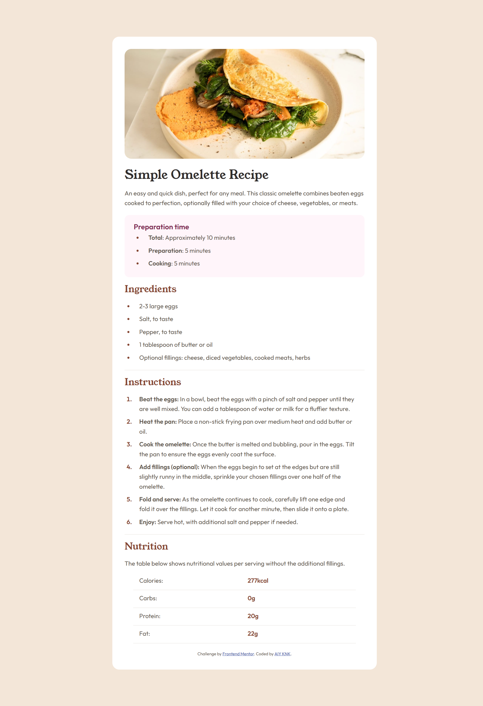

# Frontend Mentor - Recipe page solution

This is a solution to the [Recipe page challenge on Frontend Mentor](https://www.frontendmentor.io/challenges/recipe-page-KiTsR8QQKm). Frontend Mentor challenges help you improve your coding skills by building realistic projects. 

## Table of contents

- [Overview](#overview)
  - [The challenge](#the-challenge)
  - [Screenshot](#screenshot)
  - [Links](#links)
- [Author](#author)

## Overview

### Screenshot

### Links

- Solution URL: [this is my solution](https://github.com/AIY7788/recipe-page)
- Live Site URL: [And my live site here](https://aiy7788.github.io/recipe-page/)

## Author

- GitHub - [AIY7788](https://github.com/AIY7788)
- Frontend Mentor - [@AIY7788](https://www.frontendmentor.io/profile/AIY7788)
